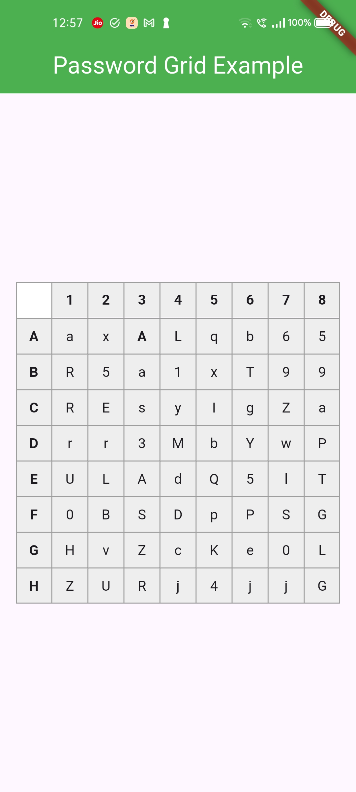

# PasswordGrid

A Flutter Package to Generate Password Grid. You can use this widget directly in your application UI.

## Stay Secure with 2FA Passcode Grid

A password grid, also called a "passcode grid," is a table with rows and columns containing unique letters or numbers where you select specific combinations to authenticate, essentially acting as a visual password by choosing specific coordinates on the grid to form your login credentials; to use it, you would typically be presented with a grid, then asked to enter the letters or numbers from specific grid positions (like "A3, B2, C1") to log in, usually requiring you to save or print the grid for future use as it's unique to your account.

## Key points about using a password grid:

### Access your grid:

While designing a authentication system, you can ask your users to enter the values in the Password grid as a 2FA passcode.
The user will be prompted to access your grid, which you should generate and show them.
The password grid can be generated at the time of user signin and they should save it for future use. so that the user can use the grid for 2FA authentication.

### Select coordinates:

The system will ask the user to enter the letters or numbers from specific grid positions, usually indicated by a combination of a column letter and row number (e.g., "B2", A8, etc).

### Enter the code:

The user will enter the values from the requested grid coordinates into the 2FA login field to authenticate.

## Benefits of a password grid:

### Enhanced security:

Since the user selects multiple characters from a grid, it's harder for someone to guess your password compared to a simple text-based password.

### Shoulder surfing resistant:

Less susceptible to "shoulder surfing" attacks where someone observes your password entry because the grid doesn't reveal the exact password sequence.

### Accessibility for some users:

Can be easier for people who struggle with remembering complex passwords.

## Usage

In your application,

```dart
import 'package:passwordgrid/main.dart';
```

then pass grid configuration

```dart
GridConfig config = GridConfig(
  numbers: true,
  alphaUpper: true,
  alphaLower: true,
  symbols: false,
  gridSize: 8, // max size is 8 and min size is 5
);
// or Optionally pass GridConfig or use default values
GridConfig? config;

// and invoke this
PasswordGrid passwordGrid = PasswordGrid(config: config);

```

```dart
// sample code
  @override
  Widget build(BuildContext context) {
    // pass grid configuration
    GridConfig config = GridConfig(
      numbers: true,
      alphaUpper: true,
      alphaLower: true,
      symbols: false,
      gridSize: 8, // max size is 8 and min size is 5
    );
    // or Optionally pass GridConfig or use default values
    // GridConfig? config;

    PasswordGrid passwordGrid = PasswordGrid(config: config);
    return Scaffold(
      appBar: AppBar(
        title: Text('Password Grid Example'),
        backgroundColor: Colors.green,
        centerTitle: true,
        titleTextStyle: TextStyle(
          color: Colors.white,
          fontSize: 24,
        ),
      ),
      body: Center(
        child: passwordGrid,
      ),
    );
  }
```

An example application of how to use this password grid package is included in the _example_ folder.

This will generate a password grid similar to



### Grid Configuration

While generating grid, you can configure the grid generation parameters.

```dart
  GridConfig config = GridConfig(
    numbers: false,
    alphaUpper: true,
    alphaLower: true,
    symbols: false,
    gridSize: 6, // max size is 8 and min size is 5
  );

```

If everything is set to _false_ as below, then it is invalid, so grid parameters will be set to default. i.e., all falsg will be set to _true_

```dart
  GridConfig config = GridConfig(
    numbers: false,
    alphaUpper: false,
    alphaLower: false,
    symbols: false,
    gridSize: 6,
  );
```
